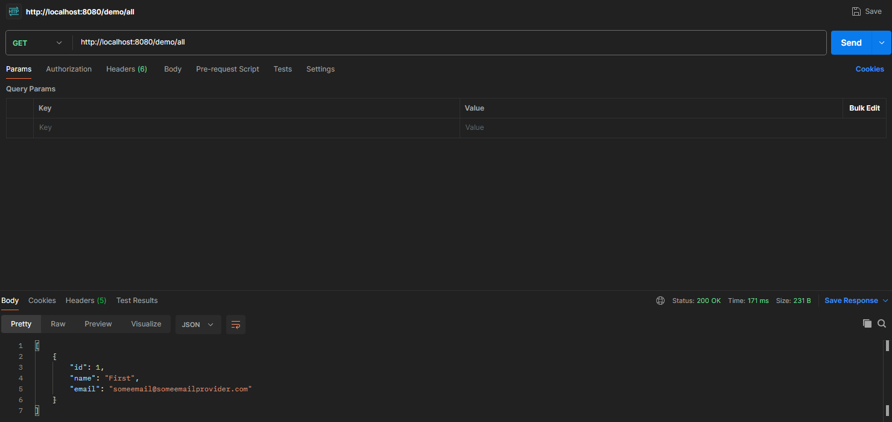

Title: Protocol GK862 - Spring Data & ORM
Author: Sebastian Pollak
Date: 2024-04-12

# Protocol GK862 - GKÜ

## Creating the Project

### Java Project

First, the Java project needs to be created. In IntelliJ, a Spring Boot project can be created. The following dependencies need to be selected: Spring Web, Spring Data JPA, and MySQL Driver.

### Docker Container

To create the Docker container, Docker Compose was used.

```yaml
version: "3"

services:
  mysql:
    image: mysql:latest
    environment:
      MYSQL_DATABASE: db_example
      MYSQL_USER: springuser
      MYSQL_PASSWORD: ThePassword
      MYSQL_ROOT_PASSWORD: root_password
    ports:
      - "3306:3306"
```

To execute this file, the following command was used in this directory

```bash
docker-compose up -d
```

## Code Dokumentation

### Spring Boot Attribute

In the "application.properties" file, the Spring attributes can be edited. In this example, it looks as follows:

```bash
spring.jpa.hibernate.ddl-auto=update
spring.datasource.url=jdbc:mysql://${MYSQL_HOST:localhost}:3306/db_example
spring.datasource.username=springuser
spring.datasource.password=ThePassword
spring.datasource.driver-class-name=com.mysql.cj.jdbc.Driver
#spring.jpa.show-sql: true
```

### @Entity Model

Here, the setter and getter methods for the program are written. Hibernate automatically translates the entity into a table.

```java
public class User {
  @Id
  @GeneratedValue(strategy=GenerationType.AUTO)
  private Integer id;

  private String name;

  private String email;

  public Integer getId() {
    return id;
  }

  public void setId(Integer id) {
    this.id = id;
  }
  ...
```

### Repository

You need to create the repository that holds user records. Spring automatically implements this repository interface.

```java
public interface UserRepository extends CrudRepository<User, Integer> {

}
```

### Controller

You need to create a controller to handle HTTP requests to your application, as shown in the following listing.

```Java
@Controller // This means that this class is a Controller
@RequestMapping(path="/demo") // This means URL's start with /demo (after Application path)
public class MainController {
  @Autowired // This means to get the bean called userRepository
         // Which is auto-generated by Spring, we will use it to handle the data
  private UserRepository userRepository;

  @PostMapping(path="/add") // Map ONLY POST Requests
  public @ResponseBody String addNewUser (@RequestParam String name
      , @RequestParam String email) {
    // @ResponseBody means the returned String is the response, not a view name
    // @RequestParam means it is a parameter from the GET or POST request

    User n = new User();
    n.setName(name);
    n.setEmail(email);
    userRepository.save(n);
    return "Saved";
  }

  @GetMapping(path="/all")
  public @ResponseBody Iterable<User> getAllUsers() {
    // This returns a JSON or XML with the users
    return userRepository.findAll();
  }
}
```

## Testing

I tested the program with Postman. It appeared as follows:
POST:


GET:


## Questions

- What is ORM and how is JPA used?
  ORM stands for Object-Relational Mapping. It's a programming technique that allows developers to map objects from an object-oriented programming language (like Java, Python, etc.) to tables in a relational database management system (such as MySQL, PostgreSQL, etc.).

  Java Persistence API (JPA) is a specification for ORM in Java applications. It provides a set of interfaces and annotations that allow developers to define mappings between Java objects and database tables, as well as perform CRUD (Create, Read, Update, Delete) operations on those objects.

- What is the application.properties used for and where must it be stored?
  The application.properties file is commonly used in Spring Boot applications for configuring various settings. It should typically be stored in the src/main/resources directory of your Spring Boot project.

- Which annotations are frequently used for entity types? Which key points must be observed?

  1. @Entity: This annotation marks a Java class as an entity, indicating that instances of this class will be persisted to the database. Each entity typically represents a row in a database table.

  2. @Table: Used to specify the details of the table to which the entity is mapped. It allows you to define the name of the table, schema, and other attributes like indexes or constraints.

  3. @Id: Marks the primary key attribute of the entity. This annotation indicates which field or property represents the unique identifier for each entity instance.

  4. @GeneratedValue: Specifies the strategy for generating primary key values automatically. It's often used in conjunction with the @Id annotation to generate unique primary key values.

  5. @Column: Used to map an entity attribute to a database column. It allows you to specify details such as column name, data type, length, nullable constraints, etc.

  6. @OneToMany, @ManyToOne, @OneToOne, @ManyToMany: These annotations define various types of relationships between entities. They are used to establish associations between entities, such as one-to-many, many-to-one, one-to-one, and many-to-many relationships.

- What methods do you need for CRUD operations?
  For CRUD operations in a Java application using JPA, you generally need the following methods:

  - Create (C):
    entityManager.persist(entity): Saves a new entity to the database.

  - Read (R):
    entityManager.find(entityClass, primaryKey): Retrieves an entity from the database based on its primary key.

  - Update (U):
    entityManager.merge(entity): Updates an existing entity in the database.

  - Delete (D):
    entityManager.remove(entity): Deletes an entity from the database.

# Protocol GK862 - GKV

## Code Dokumentation

### Main Controller

```java
@Autowired
private  WarehouseRepository warehouseRepository;

@PostMapping(path="/add")
public @ResponseBody void generateWarehouses() {
    WarehouseSimulation ws = new WarehouseSimulation();
    ws.getData(warehouseRepository);

    System.out.println("Add");
}

@GetMapping(path="/list")
public @ResponseBody Iterable<Warehouse> getAllWarehouses() {
    System.out.println("List");
    return warehouseRepository.findAll();
}
```

In dem Controller wurden neue Mappings hinzugefügt. Einmal das "/add" um neue zufällig Generierte Warehouses hinzuzufügen und einmal "/list" um die ganzen Daten angezeigt zu bekommen.

### Entities

Products:

```Java
    @Id
    @GeneratedValue(strategy=GenerationType.IDENTITY)
    private int id;
    private String productName;
    private String productCategory;
    private String productQuantity;
    private String productUnit;

    public int getId() {
        return id;
    }

    public void setId(int productID) {
        this.id = productID;
    }
    ...
```

Warehouse:

```Java
    @Id
    @GeneratedValue(strategy=GenerationType.IDENTITY)
    private int id;
    private String warehouseName;
    private String warehouseAddress;
    private String warehousePostalCode;
    private String warehouseCity;
    private String warehouseCountry;
    private String timestamp;

    @OneToMany(cascade = CascadeType.ALL)
    private List<Product> products;

    /**
     * Constructor
     */
    public Warehouse() {

        this.timestamp = new SimpleDateFormat("yyyy-MM-dd HH:mm:ss.SSS").format(new Date());
        products = new ArrayList<>(10);
    }

    /**
     * Setter and Getter Methods
     */
    public int getId() {
        return id;
    }

    public void setId(int warehouseID) {
        this.id = warehouseID;
    }
    ...
```

Hier wurden die neuen Tabellen für die Datenbank(Entities) hinzugefügt. Wichtig ist hier das "@OneToMany" welches sagt das ein Warehouse mehrer Produkte besitzen kann.

### Warehouse Simulation

Die Warehouse Simulation wurde aus der Aufgabe des vorherigen Semesters wiederverwendet. Jedoch wurde die "getData()" Methode verändert.

```Java
public void getData( WarehouseRepository warehouseRepository) {

        String[][] produkte = {
                {"Apfel", "Obst", "Stück"},
                {"Banane", "Obst", "Stück"},
                {"Karotte", "Gemüse", "Stück"},
                {"Tomate", "Gemüse", "Stück"},
                {"Huhn", "Fleisch", "Gramm"},
                {"Lachs", "Fisch", "Gramm"},
                {"Milch", "Milchprodukte", "Liter"},
                {"Käse", "Milchprodukte", "Gramm"},
                {"Brot", "Backwaren", "Stück"},
                {"Reis", "Getreideprodukte", "Gramm"},
                {"Ei", "Eier", "Stück"},
                {"Joghurt", "Milchprodukte", "Gramm"},
                {"Zucker", "Backwaren", "Gramm"},
                {"Kartoffel", "Gemüse", "Stück"},
                {"Erdbeere", "Obst", "Stück"}
        };

        Warehouse data = new Warehouse();
        data.setWarehouseName("Warehouse ");
        data.setWarehouseCity( "Linz" );
        data.setWarehouseAddress("Bahnhofsstrasse 27/9");
        data.setWarehousePostalCode("4020");
        data.setWarehouseCountry("Austria");

        List<Product> products = new ArrayList<>();

        for(int i = 0;i<10;i++){
            Product product = new Product();

            Random rand = new Random();
            int index = rand.nextInt(produkte.length);

            String[] randomProduct = produkte[index];

            product.setProductName(randomProduct[0]);
            product.setProductCategory(randomProduct[1]);
            product.setProductUnit(randomProduct[2]);

            int randomQuantity = rand.nextInt(501);
            product.setProductQuantity(String.valueOf(randomQuantity));

            products.add(product);

        }
        data.setProducts(products);

        warehouseRepository.save(data); //Speichert das generiete Warehouse in die Datenbank
    }
}
```

### Warehouse Repository
Ebenso wurde das Repository an die neue Aufgabe engpasst:

```Java
public interface WarehouseRepository extends CrudRepository<Warehouse, Integer> {
  ...
```

## Testing
Um das Programm zu Testen muss zwei mal mittels Postman eine POST Request an den Server geschicht werden:
```
http://localhost:8080/demo/add
```

Dann kann mittels einer GET Request die Datenbank ausgelesen werden:

```
http://localhost:8080/demo/list
```
